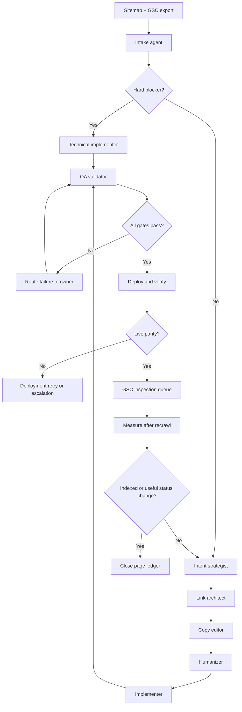

# Indexing multi-agent system

## Objective

Move the 17 Search Console-absent pages through a repeatable readiness workflow, with `audio-video-transcription-online.html` routed first. The system cannot guarantee Google indexing. It can remove crawl blockers, reduce ambiguous intent, improve discovery, validate deployment, and produce a clean queue for URL Inspection and indexing requests.

## Agent contracts

| Agent | Inputs | Output | Decision logic |
| --- | --- | --- | --- |
| Intake agent | `sitemap.xml`, GSC valid-page CSV, priority config | Exact absent cohort and priority score | Sitemap minus valid URLs. Transcription receives highest business weight. |
| Technical indexation agent | HTML, `robots.txt`, live response, sitemap | Blocker report with evidence | Fail on non-200, noindex, blocked crawl, wrong canonical, missing sitemap entry, invalid schema, or broken hreflang. |
| Link architect | Static HTML link graph and page taxonomy | Source, target, anchor, and click-depth plan | Prefer contextual links from relevant strong pages. Reject generic anchors and full-mesh linking. |
| Intent strategist | Titles, H1s, body copy, related indexed pages | One primary intent per page and overlap score | If two pages answer the same task with the same format and promise, differentiate or consolidate. |
| Copy editor | Intent brief, product context, current copy | Seven-Sweeps revision | Preserve message and product truth. Fix clarity first, then tone, benefit, proof, specificity, emotion, and risk. |
| Humanizer | Edited copy and brand voice | Natural final copy plus pattern audit | Reject AI filler, promotional claims, repetitive cadence, vague attribution, and em or en dashes. |
| Implementer | Approved patch plan and file ownership | Disjoint file patches | Preserve IDs, classes, schema, local processing claims, and tool position. |
| QA validator | Repo diff and readiness config | Pass/fail report | Run blocker, link, schema, metadata, sitemap, excluded-utility, and tool-hook checks. |
| Deployment verifier | Production URLs and commit SHA | Live parity report | Confirm production serves expected canonical, content marker, status, and sitemap `lastmod`. |
| GSC operator | QA pass, live parity, URL priority queue | Inspection/request ledger | Request flagship first, then commercial tools, guides, Arabic alternate, and legal pages last. |

## Routing



## Validation and feedback loops

1. Blocker gate: every target must be crawlable, indexable, canonical, present in the sitemap, and valid HTML with parseable JSON-LD.
2. Quality gate: every target owns one intent, has descriptive contextual inbound links, useful original copy, honest limits, and consistent brand attribution.
3. Humanizer gate: touched copy gets a draft, AI-pattern audit, and final pass. Meaning and visible section coverage stay intact.
4. Diff gate: reject changes to tool hooks, upload IDs, export controls, translation utilities, or unrelated files.
5. Live gate: compare deployed status, canonical, metadata marker, sitemap date, and selected content against the merged commit.
6. Search Console loop: inspect exclusion reason after recrawl. Route `duplicate` to intent/canonical work, `crawled not indexed` to quality work, and `discovered not indexed` to discovery and crawl-priority work.

Each failed gate returns structured evidence to the owning agent. Retry up to three times. Repeated identical failure becomes a human escalation instead of an endless rewrite loop.

## Failure handling

- Missing or stale GSC export: continue repo QA, but label index status unknown. Do not invent an exclusion reason.
- Live deployment lag: wait and retry with backoff. Do not submit an old production page for indexing.
- Conflicting edits: stop the affected file, preserve existing work, and rebase the patch around current content.
- Copy quality regression: restore intent brief, rerun Seven Sweeps, then humanizer and schema parity checks.
- Broken tool behavior: reject the content patch if IDs, data attributes, scripts, or export workflow changed.
- Google declines indexing: record the actual URL Inspection reason, compare against the assigned intent owner, and route only the relevant corrective task.

## Optimization and scale

- Use `automation/indexing-priority.json` as the queue contract. Add cohorts without changing agent prompts.
- Cache parsed HTML and link graphs so large sites do not rescan every file for each agent.
- Run technical, link, and intent audits in parallel. Serialize edits by explicit file ownership.
- Replace runtime full-mesh related links with a build-time manifest of four workflow tools and two guides per page.
- Keep machine-readable reports for each run: cohort, blockers, warnings, intent owner, retries, deploy SHA, live verification, and GSC result.
- Score queue order by business value, index status, recency, internal-link weakness, and overlap risk. Never prioritize legal pages over core tools.
- For hundreds of pages, shard by topic cluster and locale. Keep one validator and one deployment ledger across shards.

## Commands

```bash
npm run seo:check-indexing
npm run seo:update-sitemap
npm run seo:check-sitemap
```

After both checks pass and production matches the commit, submit the English transcription page first in Search Console URL Inspection.
