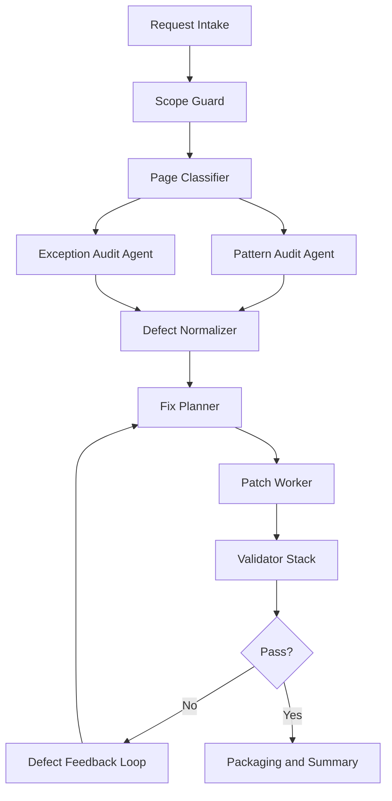

# Technical SEO Multi-Agent System

## Goal

Design a production-ready multi-agent system that can audit and fix page-level technical SEO issues across a scoped set of FreeAudioTrim pages without breaking runtime behavior.

This system is designed for tasks like:

- page-level technical SEO audits
- metadata and schema normalization
- asset-versioning hygiene
- script-loading safety improvements
- technical SEO validation on tool pages, blog pages, legal pages, and localized pages

It is optimized for the FreeAudioTrim repo, where:

- pages are static HTML
- many pages share repeated SEO and asset patterns
- tool pages can be runtime-sensitive
- fixes must stay scoped and verifiable

## System Principles

1. Use a gated orchestrator, not a loose swarm.
2. Keep each agent narrow and accountable.
3. Separate audit, fix planning, implementation, and validation.
4. Treat runtime-sensitive tool pages as higher-risk than static legal or blog pages.
5. Never let a single agent both invent and approve its own changes.
6. Re-run validation after every fix batch until the page set passes.

## High-Level Flow



## Agent Catalog

### 1. Request Intake Agent

Role:
- Parse the task request.
- Extract scope, constraints, and output expectations.

Inputs:
- user prompt
- page list
- repo path

Outputs:
- normalized task brief
- explicit scope list
- non-goals list

Decision logic:
- If the request includes specific files, freeze scope to those files.
- If the request says not to touch tool logic, mark runtime code as protected unless a fix is proven safe and necessary.

### 2. Scope Guard Agent

Role:
- Prevent scope drift.
- Decide which files can be audited, edited, or only referenced.

Inputs:
- normalized task brief
- repo tree
- page list

Outputs:
- allowed edit set
- protected file set
- escalation flags

Decision logic:
- Legal, blog, and directory pages are low-risk.
- Tool pages with shared runtime hooks are medium/high-risk.
- Shared JS/CSS changes are allowed only if needed by multiple in-scope pages and validated.

### 3. Page Classifier Agent

Role:
- Group pages by risk and template family.

Inputs:
- page list
- HTML source

Outputs:
- page classes
  - `blog`
  - `legal`
  - `directory`
  - `tool-simple`
  - `tool-runtime-sensitive`
  - `localized-tool`

Decision logic:
- Pages using shared tool scripts like `trim-tool.js`, `upload.js`, `transcribe-tool.js`, or specialized browser processing are classified as runtime-sensitive.
- Pages with only static content and navigation are low-risk.

### 4. Pattern Audit Agent

Role:
- Find repeated technical SEO issues that can be fixed safely in batches.

Inputs:
- HTML sources
- robots.txt
- sitemap.xml
- asset conventions

Outputs:
- pattern defect list with page coverage

Typical checks:
- canonical presence
- robots meta
- FAQ visible but missing FAQ schema
- stale `priceValidUntil`
- unversioned core CSS/JS
- `lucide@latest`
- mismatched OG/Twitter/schema fields
- irrelevant content blocks adding request weight

Decision logic:
- If the same issue appears on 3 or more pages with the same markup shape, classify it as a bulk-fix candidate.

### 5. Exception Audit Agent

Role:
- Find page-specific issues that should not be handled mechanically.

Inputs:
- pages flagged by classifier or pattern audit

Outputs:
- page-specific defects
- page-specific fix notes

Examples:
- ringtone page eager FFmpeg loading
- transcription pages with special script/version dependencies
- Arabic page i18n and localization concerns

Decision logic:
- If a page has runtime-specific behavior or localization-specific schema, force manual review before patching.

### 6. Defect Normalizer Agent

Role:
- Convert raw findings into structured defects.

Inputs:
- pattern audit findings
- exception audit findings

Outputs:
- defect objects in a standard schema

Defect schema:

```json
{
  "id": "TSEO-FAQ-001",
  "page": "/free-mp3-cutter.html",
  "class": "tool-runtime-sensitive",
  "severity": "medium",
  "type": "structured-data-gap",
  "evidence": "Visible FAQ details present but no FAQPage JSON-LD",
  "safe_fix": true,
  "fix_shape": "inject FAQPage schema before </head>",
  "validation_required": ["source-check", "browser-load-check"]
}
```

Decision logic:
- Only defects with clear evidence and safe fix shapes move to the planner.
- Ambiguous defects are escalated instead of auto-patched.

### 7. Fix Planner Agent

Role:
- Convert defects into patch batches.

Inputs:
- normalized defects
- page classes
- risk labels

Outputs:
- patch batches
- validation requirements per batch

Decision logic:
- Group low-risk static fixes together:
  - asset versioning
  - pinned library URLs
  - metadata field cleanup
- Keep runtime-sensitive changes isolated:
  - one page or one shared runtime family at a time
- Require a validator rerun after every runtime-sensitive batch.

### 8. Patch Worker Agent

Role:
- Apply the planned edits.

Inputs:
- patch batch
- file leases

Outputs:
- modified files
- patch summary

Decision logic:
- For small targeted edits, use direct patching.
- For repeated mechanical changes across many pages, use controlled scripted transforms.
- Never edit files outside the leased set.

### 9. Validator Stack

Role:
- Confirm that fixes actually improved the pages without causing regressions.

Inputs:
- modified files
- original defect list

Outputs:
- pass/fail verdict
- residual defect list
- regressions list

Validation layers:

1. Source Integrity Validator
- confirms canonical, robots, schema, asset versioning, and metadata fields

2. Runtime Safety Validator
- browser-load check for console errors and missing mounts

3. Structured Data Validator
- verifies inserted JSON-LD is syntactically valid and aligned with visible content

4. Scope Validator
- confirms no out-of-scope files were changed

5. Regression Validator
- ensures key page elements still render:
  - upload shell
  - tool root
  - navigation
  - FAQ

Decision logic:
- Any runtime error on an edited tool page sends the batch back to planning.
- Any schema mismatch sends the batch back to the patch worker.

### 10. Packaging and Summary Agent

Role:
- Produce the final output.

Inputs:
- validated results
- changed files
- unresolved risks

Outputs:
- concise user summary
- optional status doc/report
- commit-ready change summary

Decision logic:
- Report what was fixed, what was validated, and what remains unverified.

## Routing Logic

### Route by page type

- `blog/*`
  - route to static metadata batch
- `privacy-policy.html`, `terms-of-service.html`, `tools.html`
  - route to static SEO plumbing batch
- `audio-video-transcription-online.html`, `ar/audio-video-transcription-online.html`
  - route to localized/runtime-sensitive audit lane
- `free-mp3-cutter.html`, `audio-cutter-online.html`
  - route to trim-tool runtime-sensitive lane
- `audio-pitch-changer.html`, `audio-speed-changer.html`
  - route to specialized tool runtime lane

### Route by defect type

- `structured-data-gap`
  - to schema patch sub-lane
- `asset-versioning-gap`
  - to bulk asset patch lane
- `third-party-runtime-drift`
  - to dependency normalization lane
- `request-weight-noise`
  - to page-specific cleanup lane

## Feedback Loops

### Loop 1: Defect Refinement Loop

Trigger:
- validator says issue still exists after patch

Action:
- defect returns to Fix Planner with updated evidence

Example:
- FAQ schema inserted, but malformed JSON-LD
- planner narrows fix to schema serialization only

### Loop 2: Runtime Regression Loop

Trigger:
- browser validation reports console/page errors

Action:
- revert risky runtime part of the batch
- split patch into smaller units
- rerun validation

Example:
- adding `defer` to a tool script breaks an inline mount path
- planner downgrades that fix to version-only and leaves execution order intact

### Loop 3: Scope Breach Loop

Trigger:
- patch touches non-leased files

Action:
- reject batch
- re-plan with smaller file lease

### Loop 4: Truth Alignment Loop

Trigger:
- schema or metadata claim does not match visible content

Action:
- reject fix and align visible content or remove stale claim

## Failure Handling

### Failure Class A: Audit ambiguity

Example:
- page appears to need a speed fix, but runtime sensitivity is unknown

Handling:
- classify as manual review
- do not apply automatic defer/lazy-load change

### Failure Class B: Runtime breakage

Example:
- tool root stops mounting after script-order edit

Handling:
- auto-rollback patch batch
- preserve safe metadata-only changes
- open exception ticket for manual runtime handling

### Failure Class C: Schema mismatch

Example:
- FAQPage JSON-LD no longer matches current visible FAQ

Handling:
- rebuild schema from visible source content only

### Failure Class D: Live deploy lag

Example:
- repo is fixed but production still serves older asset URLs

Handling:
- separate local validation from live validation
- keep a deploy verification lane that checks actual served versions

## Optimization Strategy

### 1. Batch low-risk fixes

Bulk-fix together:
- global/layout/blog/upload/tools CSS versioning
- `mobile-menu.js` versioning
- `related-tools.js` versioning
- `lucide@latest` pinning

### 2. Isolate runtime-sensitive fixes

Handle separately:
- FFmpeg load behavior
- transcription worker/script boot paths
- trim-tool script-order changes

### 3. Generate schema from visible content

For FAQ pages:
- derive JSON-LD from `<details>` blocks
- avoids manual drift across many pages

### 4. Use a page-family registry

Maintain a registry like:

```json
{
  "blog": {
    "css": ["/css/global.css", "/assets/layout.css", "/css/blog.css"],
    "js": ["/assets/mobile-menu.js"]
  },
  "trim-tool": {
    "css": ["/css/global.css", "/assets/layout.css", "/assets/upload.css"],
    "js": ["/assets/encoders/lame.min.js", "/assets/encoders/mp3-encoder.js", "/assets/trim-tool.js", "/assets/upload.js", "/assets/related-tools.js", "/assets/mobile-menu.js"]
  }
}
```

This lets the planner patch families instead of individual pages.

## Scalability

### Works for 10 pages

- one orchestrator
- one pattern audit pass
- one exception pass
- 2 to 4 patch batches

### Works for 100+ pages

- shard by page family
- run pattern audit in parallel per family
- merge defects into one normalized queue
- process low-risk batches first
- keep high-risk runtime pages serialized

### Works across multilingual pages

- add locale-aware validators
- require canonical, hreflang, and visible-language checks
- use a truth guard for translated metadata/schema

## Real-World Implementation Contracts

### File Lease Contract

Each worker receives:

```json
{
  "lease_id": "lease-2026-05-18-001",
  "allowed_files": [
    "/audio-cutter-online.html",
    "/free-mp3-cutter.html"
  ],
  "disallowed_files": [
    "/assets/trim-tool.js"
  ]
}
```

### Validation Verdict Contract

```json
{
  "batch_id": "batch-trim-tool-seo-01",
  "status": "failed",
  "blocking_issues": [
    {
      "type": "runtime-regression",
      "file": "/audio-cutter-online.html",
      "evidence": "console error after script-order change"
    }
  ],
  "retry_strategy": "remove defer change and revalidate"
}
```

### Completion Contract

```json
{
  "pages_processed": 17,
  "issues_fixed": 42,
  "runtime_regressions": 0,
  "residual_risks": [
    "live deploy propagation may lag local fixes"
  ]
}
```

## Recommended Deployment Workflow

1. Run local source audit.
2. Apply low-risk batch fixes.
3. Run local browser validation.
4. Apply page-specific fixes.
5. Re-run validation.
6. Commit only when all in-scope pages pass.
7. Push and verify live-served asset versions.
8. Reopen only the pages that fail live verification.

## Why This Works

This system is reliable in real-world use because it:

- keeps bulk work mechanical where safe
- isolates risky runtime changes
- validates every batch before completion
- uses feedback loops instead of one-pass assumptions
- scales from a few pages to a large static site
- matches how FreeAudioTrim actually shares code and templates
